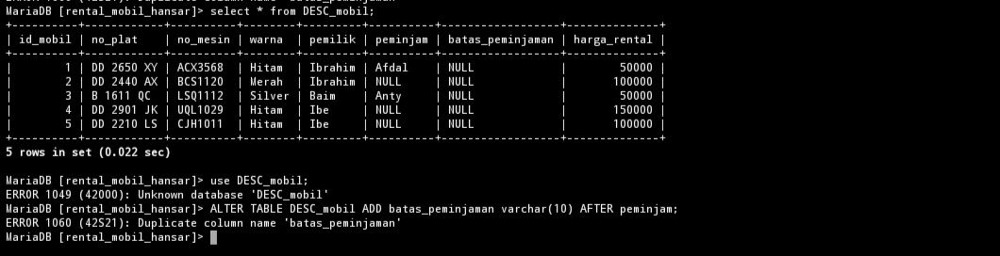
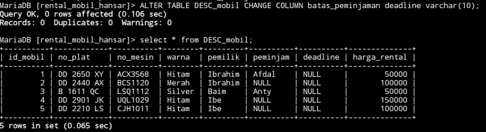
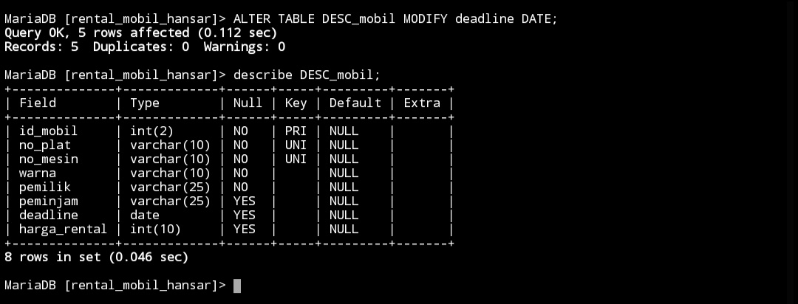
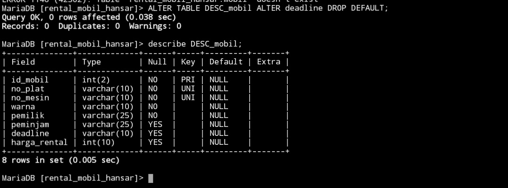
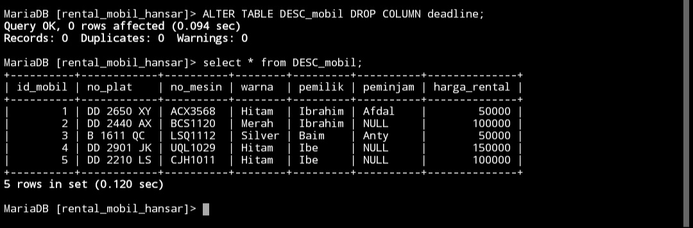
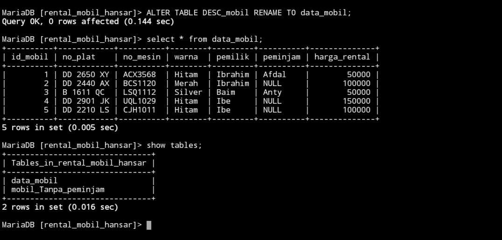

## Menambahkan kolom
### Struktrur query
```mysql
ALTER TABLE nama_table ADD nama_kolom_baru varchar(10) AFTER nama_kolom_lama;
```

### Kode Program
```mysql
ALTER TABLE DESC_mobil ADD batas_peminjaman varchar(10) AFTER peminjam;
```

### Hasil



### Analisis
- `ALTER TABLE mobil`: Perintah untuk mengubah struktur tabel `mobil`.
- `ADD batas_peminjaman varchar(10)`: Menambahkan kolom baru dengan nama `batas_peminjaman` yang memiliki tipe data `varchar(10)`.
- `AFTER peminjam`: Menentukan bahwa kolom baru akan ditambahkan setelah kolom `peminjam` dalam struktur tabel.

> [!summary]- Kesimpulan
> Perintah ini digunakan untuk menambahkan kolom `batas_peminjaman` dengan tipe data `varchar(10)` ke tabel `mobil` setelah kolom `peminjam`. Dengan menambahkan kolom ini, Anda dapat menyimpan informasi tentang batas peminjaman untuk setiap mobil dalam tabel.


## Mengubah nama kolom
### Struktur query
```mysql
ALTER TABLE nama_table CHANGE COLUMN nama_kolom_lama nama_kolom_baru varchar(10);
```

### Kode program
```mysql
ALTER TABLE DESC_mobil CHANGE COLUMN batas_peminjaman deadline varchar(10);
```

### Hasil



### Analisis
- `ALTER TABLE mobil`: Perintah untuk mengubah struktur tabel `mobil`.
- `CHANGE COLUMN batas_peminjaman deadline varchar(10)`: Mengubah kolom `batas_peminjaman` menjadi `deadline` dengan tipe data `varchar(10)`.


> [!summary]- Kesimpulan
> Perintah ini mengubah nama kolom `batas_peminjaman` menjadi `deadline` dan mengubah tipe data menjadi `varchar(10)` dalam tabel `mobil`. Dengan ini, Anda dapat menggunakan nama kolom baru `deadline` untuk menyimpan informasi tentang batas peminjaman untuk setiap mobil dalam tabel.


## Mengubah tipe data kolom
### Struktur query
```mysql
ALTER TABLE nama_table MODIFY nama_kolom tipe_data_baru
```

### Kode Program
```mysql
ALTER TABLE DESC_mobil MODIFY deadline DATE;
```


### Hasil



### Analisis
- `ALTER TABLE mobil`: Perintah untuk mengubah struktur tabel `mobil`.
- `MODIFY deadline DATE`: Mengubah tipe data kolom `deadline` menjadi `DATE`.


> [!summary]- Kesimpulan
> Perintah ini mengubah tipe data kolom `deadline` dalam tabel `mobil` menjadi `DATE`. Dengan ini, Anda dapat menggunakan kolom `deadline` untuk menyimpan informasi tentang batas peminjaman dalam format tanggal, yang lebih tepat dan mudah untuk dikelola.


## Menambahkan constraint
### struktur query 
```mysql
ALTER TABLE nama_table ALTER nama_kolom SET DEFAULT 'nama_constraint';
```

### Kode program
```mysql
ALTER TABLE DESC_mobil ALTER deadline SET DEFAULT 'Ready';
```

### Hasil


### Analisis
- `ALTER TABLE mobil`: Perintah untuk mengubah struktur tabel `mobil`.
- `ALTER deadline SET DEFAULT 'Ready'`: Mengatur nilai default kolom `deadline` menjadi 'Ready'.

> [!summary]- Kesimpulan
> Perintah ini mengubah nilai default kolom `deadline` dalam tabel `mobil` menjadi 'Ready'. Ini berarti jika tidak ada nilai yang diberikan untuk kolom `deadline` saat sebuah baris dimasukkan ke dalam tabel, maka nilainya akan secara otomatis diatur sebagai 'Ready'.

## Menghapus constraint
### Struktur query 
```mysql 
ALTER TABLE nama_table ALTER nama_kolom DROP DEFAULT;
```

### Kode program
```mysql
ALTER TABLE DESC_mobil ALTER deadline DROP DEFAULT;
```

### Hasil



### Analisis
- `ALTER TABLE mobil`: Perintah untuk mengubah struktur tabel `mobil`.
- `ALTER deadline DROP DEFAULT`: Menghapus nilai default yang sebelumnya ditetapkan untuk kolom `deadline`.

> [!summary]- Kesimpulan
> Perintah ini menghapus nilai default yang sebelumnya ditetapkan untuk kolom `deadline` dalam tabel `mobil`. Setelah perintah ini dijalankan, jika tidak ada nilai yang diberikan untuk kolom `deadline` saat sebuah baris dimasukkan ke dalam tabel, maka kolom tersebut akan memiliki nilai NULL.


## Menghapus kolom
### Struktur query
```mysql
ALTER TABLE nama_table DROP COLUMN nama_kolom;
```

### Kode program
```mysql
ALTER TABLE DESC_mobil DROP COLUMN deadline;
```

### Hasil



### Analisis
1. **Perintah SQL**: `ALTER TABLE` adalah perintah SQL yang digunakan untuk mengubah struktur dari tabel yang ada dalam database.
    
2. **Tabel yang Diubah**: `DESC_mobil` adalah nama tabel yang saat ini ada di dalam database.
    
3. **Perubahan yang Dilakukan**: `RENAME TO` adalah bagian dari perintah `ALTER TABLE` yang digunakan untuk mengganti nama tabel.
    
4. **Nama Tabel Baru**: `data_mobil` adalah nama baru yang akan diberikan kepada tabel `DESC_mobil`.

> [!summary]- Kesimpulan
> Digunakan untuk menghapus kolom `deadline` dari tabel `DESC_mobil`. Ini berarti data dalam kolom tersebut akan hilang secara permanen, dan struktur tabel akan diubah untuk tidak lagi menyertakan kolom tersebut. Perintah ini harus digunakan dengan hati-hati, memastikan bahwa data penting tidak hilang dan bahwa semua query atau aplikasi yang bergantung pada kolom tersebut diperbarui sesuai kebutuhan. Backup data sebelum melakukan perubahan struktural ini adalah langkah yang sangat direkomendasikan.

## Mengganti nama table
### Struktur query
```mysql
ALTER TABLE nama_table_lama RENAME TO nama_table_baru;
```

### Kode program
```mysql
ALTER TABLE DESC_mobil RENAME TO data_mobil;
```

### Hasil


### Analisis
1. **Perintah SQL**: `ALTER TABLE` adalah perintah SQL yang digunakan untuk mengubah struktur dari tabel yang ada dalam database.
    
2. **Tabel yang Diubah**: `DESC_mobil` adalah nama tabel yang saat ini ada di dalam database.
    
3. **Perubahan yang Dilakukan**: `RENAME TO` adalah bagian dari perintah `ALTER TABLE` yang digunakan untuk mengganti nama tabel.
    
4. **Nama Tabel Baru**: `data_mobil` adalah nama baru yang akan diberikan kepada tabel `DESC_mobil`.

> [!summary]- Kesimpulan
> Kesimpulannya adalah perintah SQL tersebut digunakan untuk mengganti nama sebuah tabel dari "nama_table_lama" menjadi "nama_table_baru". Dengan menjalankan perintah ini, struktur dan data tabel tetap sama, hanya nama tabel yang berubah.

