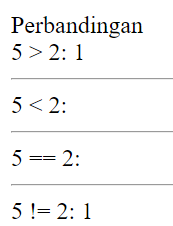
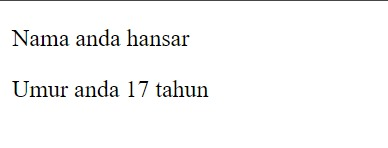

# Apa itu Web Dinamis?

Web dinamis adalah jenis situs web yang dapat menghasilkan konten yang berubah atau disesuaikan secara dinamis berdasarkan permintaan pengguna. Konten dinamis dapat dihasilkan melalui interaksi dengan pengguna, pengambilan data dari basis data, integrasi dengan layanan eksternal, dan pemrosesan logika bisnis. Web dinamis menggunakan bahasa pemrograman server-side untuk menghasilkan dan mengelola konten dinamis ini.

# Apa itu PHP?

PHP (PHP: Hypertext Preprocessor) adalah salah satu bahasa pemrograman yang sering digunakan untuk mengembangkan web dinamis. PHP adalah bahasa pemrograman sisi server yang dirancang khusus untuk pengembangan web. Itu dapat diintegrasikan dengan HTML untuk menghasilkan konten dinamis. PHP berjalan di sisi server, yang berarti kode PHP dieksekusi di server web sebelum hasilnya dikirim ke browser pengguna.
# Program pertama PHP
## Cara 
1. Buka XAMPP, kemudian klik tombol start pada 'apache'
2. Open file manager
3. Open di Drive D
4. Kemudian Open folder XAMPP
5. Lalu open folder htdocs
6. Buat folder baru di dalam htdocs 
7. Lalu open folder yang sudah Anda buat
8. Open VSCode
9. Open folder yang sudah Anda buat di VSCode
10. Buat file baru di VSCode dengan ekstensi `.php` di folder yang sudah Anda buka

# PHP Dasar
## Echo
### Kutip satu
kutip satu hanya bisa membaca teks atau STRING, variabel dan string
dipisahkan dengan tanda titik
### Kutip dua
kutip dua bisa membaca nilai dari variabel

### Penjelasan
1. Penggunaan Dasar:
   - `echo` adalah perintah dasar dalam PHP yang digunakan untuk menampilkan teks atau nilai pada halaman web.
   - Anda dapat menggunakan `echo` untuk menampilkan teks statis atau untuk menampilkan nilai dari variabel atau ekspresi.
   - `echo` dapat menerima satu atau lebih argumen yang dipisahkan oleh tanda titik (.) untuk menggabungkan teks dan variabel.

2. Menampilkan Teks:
   - Anda dapat menggunakan `echo` untuk langsung menampilkan teks statis dalam tanda kutip ganda ("") atau tanda kutip tunggal ('').
   - Contoh: `echo "Halo, dunia!";`

3. Menampilkan Nilai Variabel:
   - Anda dapat menggunakan `echo` untuk menampilkan nilai dari variabel dalam teks yang ditampilkan.
   - Gunakan operator konkatenasi (tanda titik) untuk menggabungkan teks dan variabel.
   - Contoh: 
     ```php
     $nama = "John Doe";
     echo "Halo, nama saya " . $nama . ".";
     ```

4. Menampilkan HTML:
   - Selain teks, Anda juga dapat menggunakan `echo` untuk menampilkan kode HTML di dalam skrip PHP.
   - Uji coba berikut menunjukkan penggunaan `echo` untuk menampilkan elemen HTML:
     ```php
     echo "<h1>Selamat Datang!</h1>";
     echo "<p>Ini adalah halaman web PHP.</p>";
     ```

5. Penggunaan Kutipan:
   - Anda dapat menggunakan tanda kutip ganda ("") atau tanda kutip tunggal ('') untuk mengelilingi teks dalam `echo`.
   - Misalnya, `echo "Halo, nama saya 'John'.";`

6. Menggunakan Pemisah:
   - Saat menggunakan `echo` dengan beberapa argumen, Anda dapat menggunakan koma (,) sebagai pemisah antara argumen.
   - Contoh: `echo "Halo,", " nama saya ", $nama, ".";`

Materi `echo` pada PHP memungkinkan Anda untuk menampilkan teks, nilai variabel, dan bahkan kode HTML di dalam skrip PHP. Hal ini berguna dalam menghasilkan tampilan dinamis pada halaman web yang sedang Anda bangun.

## Komentar
### Single line
Komentar Satu Baris:
   - Komentar satu baris dimulai dengan tanda `//` atau `#`.
   - Semua teks setelah tanda tersebut hingga akhir baris diabaikan oleh interpreter PHP.
   - Contoh:
```php
//ini komentar 1 baris menggunakan dua slice
```
### Multiple line
Komentar multibaris dimulai dengan `/*` dan diakhiri dengan `*/`.
   - Semua teks di antara tanda tersebut diabaikan oleh interpreter PHP.
   - Komentar multibaris dapat mencakup beberapa baris kode.
   - Contoh:
```php
/*
ini
komentar
multibaris
menggunakan satu slice dan bintang
*/
```

Tujuan Penggunaan Komentar:
   - Memberikan penjelasan tentang tujuan dan fungsionalitas kode.
   - Membantu dalam pemeliharaan dan pemahaman kode untuk pengembang dan anggota tim lainnya.
   - Menyembunyikan atau menonaktifkan sebagian kode untuk uji coba atau sementara.
   - Meninggalkan catatan atau pesan kepada diri sendiri atau pengembang lain tentang kode tertentu.
Penggunaan komentar yang baik sangat penting dalam pemrograman untuk menjaga kejelasan dan keberlanjutan kode. Dengan menggunakan komentar yang tepat, Anda dapat meningkatkan kemudahan pemeliharaan dan kolaborasi dalam pengembangan perangkat lunak.
## Variabel & Konstanta
### Variabel
 *Variabel*: Variabel adalah simbol yang digunakan untuk menyimpan nilai yang dapat berubah selama jalannya program. Dalam PHP, variabel dinyatakan dengan awalan dolar ($) diikuti dengan nama variabel,
- Variabel adalah tempat penyimpanan untuk nilai-nilai dalam sebuah program.
- Setiap variabel memiliki nama yang unik yang digunakan untuk mengidentifikasinya.
- Variabel dapat menyimpan berbagai jenis data seperti angka, teks, boolean, array, dan lainnya.

```php
$ketua_gank = "bombom";
```

Variabel di atas menyimpan data ketua_genk dengan nilai "bombom". Nilai variabel ini dapat diubah selama jalannya program.
### Constanta
*Konstanta*: Konstanta adalah nilai yang tetap dan tidak dapat diubah selama jalannya program. Mereka berguna untuk menyimpan nilai yang tidak boleh berubah, seperti nilai pi (π) atau nilai-nilai pengaturan yang tetap. Dalam PHP, konstanta didefinisikan menggunakan fungsi define().
- Konstanta adalah nilai yang tetap dan tidak berubah selama jalannya program.
- Nilai konstanta didefinisikan sekali dan tidak dapat diubah kembali.
- Biasanya digunakan untuk menyimpan nilai-nilai seperti konstanta matematis atau pengaturan yang tetap.
```php
const KepSek = "Herwelis";
echo 'KepSeknya Pak ' . KepSek;
```

Dalam contoh di atas, kita mendefinisikan konstanta  dKepSek dengan nilai "Herwelis".

## Operator
### Aritmatika
#### Penjelasan
Operator aritmatika merupakan operator untuk melakukan operasi aritmatika.
Operator aritmatika terdiri dari:

| Nama Operator | Simbol |
| ------------- | ------ |
| Penjumlahan   | `+`    |
| Pengurangan   | `-`    |
| Perkalian     | `*`    |
| Pemangkatan   | `**`   |
| Pembagian     | `/`    |
| Sisa Bagi     | `%`    |

#### Program
```php
$a = 5;
$b = 2;
// penjumlahan
$c = $a + $b;
echo "$a + $b = $c";
echo "<hr>";
// pengurangan
$c = $a - $b;
echo "$a - $b = $c";
echo "<hr>";
// Perkalian
$c = $a * $b;
echo "$a * $b = $c";
echo "<hr>";
// Pembagian
$c = $a / $b;
echo "$a / $b = $c";
echo "<hr>";
// Sisa bagi
$c = $a % $b;
echo "$a % $b = $c";
echo "<hr>";
// Pangkat
$c = $a ** $b;
echo "$a ** $b = $c";
```
#### Hasil

#### Analisis
1. **Penjumlahan:**
    `$c = $a + $b; echo "$a + $b = $c"; echo "<hr>";`
    
    - Variabel $c menyimpan hasil penjumlahan $a dan $b (5 + 2 = 7).
    - Hasil penjumlahan ditampilkan sebagai "5 + 2 = 7" dan diikuti dengan garis horizontal.
2. **Pengurangan:**
    `$c = $a - $b; echo "$a - $b = $c"; echo "<hr>";`
    
    - Variabel $c menyimpan hasil pengurangan $a dan $b (5 - 2 = 3).
    - Hasil pengurangan ditampilkan sebagai "5 - 2 = 3" dan diikuti dengan garis horizontal.
3. **Perkalian:**
     - Variabel $c menyimpan hasil perkalian $a dan $b (5 * 2 = 10).
     -   Hasil perkalian ditampilkan sebagai "5 * 2 = 10" dan diikuti dengan garis horizontal.
4. **Pembagian:**
    `$c = $a / $b; echo "$a / $b = $c"; echo "<hr>";`
    
    - Variabel $c menyimpan hasil pembagian $a dan $b (5 / 2 = 2.5).
    - Hasil pembagian ditampilkan sebagai "5 / 2 = 2.5" dan diikuti dengan garis horizontal.
5. **Sisa bagi:**
    `$c = $a % $b; echo "$a % $b = $c"; echo "<hr>";`
    
    - Variabel $c menyimpan sisa hasil bagi $a dan $b (5 % 2 = 1).
    - Hasil sisa bagi ditampilkan sebagai "5 % 2 = 1" dan diikuti dengan garis horizontal.
6. **Pangkat:**
    `$c = $a ** $b; echo "$a ** $b = $c";`
    
    - Variabel $c menyimpan hasil pemangkatan $a dengan $b (5 ** 2 = 25).
    - Hasil pemangkatan ditampilkan sebagai "5 ** 2 = 25".

### Perbandingan
#### Penjelasan
Operator perbandingan adalah operator untuk membandingkan dua buah nilai.
Hasil operasi dari operator perbandingan akan menghasilkan nilai dengan tipe data _boolean_, yaitu `true` (benar) dan `false` (salah).
Berikut ini daftar operator relasi:

| Nama Operator           | Simbol          |
| ----------------------- | --------------- |
| Lebih Besar             | `>`             |
| Lebih Kecil             | `<`             |
| Sama Dengan             | `==` atau `===` |
| Tidak Sama dengan       | `!=` atau `!==` |
| Lebih Besar Sama dengan | `>=`            |
| Lebih Kecil Sama dengan | `<=`            |
#### Program
```php
// lebih besar
$c = $a > $b;
echo "$a > $b: $c";
echo "<hr>";
// lebih kecil
$c = $a < $b;
echo "$a < $b: $c";
echo "<hr>";
// lebih sama dengan
$c = $a == $b;
echo "$a == $b: $c";
echo "<hr>";
// lebih tidak sama dengan
$c = $a != $b;
echo "$a != $b: $c";
echo "<hr>";
```
#### Hasil


#### Analisis
1. **Lebih Besar**
    `$c = $a > $b; echo "$a > $b: $c"; echo "<hr>";`
    
    - Variabel $c menyimpan hasil perbandingan apakah $a lebih besar dari $b (5 > 2).
    - Karena pernyataan ini benar, $c akan bernilai `true` (yang akan ditampilkan sebagai 1 dalam PHP).
    - Hasil perbandingan ditampilkan sebagai "5 > 2: 1" dan diikuti dengan garis horizontal.
2. **Lebih Kecil:**
    `$c = $a < $b; echo "$a < $b: $c"; echo "<hr>";`
    
    - Variabel $c menyimpan hasil perbandingan apakah $a lebih kecil dari $b (5 < 2).
    - Karena pernyataan ini salah, $c akan bernilai `false` (yang akan ditampilkan sebagai kosong atau 0 dalam PHP).
    - Hasil perbandingan ditampilkan sebagai "5 < 2: " (tanpa nilai karena false) dan diikuti dengan garis horizontal.
3. **Sama Dengan:**
    `$c = $a == $b; echo "$a == $b: $c"; echo "<hr>";`
    
    - Variabel $c menyimpan hasil perbandingan apakah $a sama dengan $b (5 == 2).
    - Karena pernyataan ini salah, $c akan bernilai `false`.
    - Hasil perbandingan ditampilkan sebagai "5 == 2: " (tanpa nilai karena false) dan diikuti dengan garis horizontal.
4. **Tidak Sama Dengan:**
`$c = $a != $b; echo "$a != $b: $c"; echo "<hr>";`

- Variabel $c menyimpan hasil perbandingan apakah $a tidak sama dengan $b (5 != 2).
- Karena pernyataan ini benar, $c akan bernilai `true`.

### Logika
#### Penjelasan
Operator logika adalah operator untuk melakukan operasi logika seperti `AND`, `OR`, dan `NOT`.
Operator logika terdiri dari:

| Nama Operator         | Simbol |
| --------------------- | ------ |
| Logika AND            | `&&`   |
| Logika OR             | `\|`   |
| Negasi/kebalikan/ NOT | `!`    |
#### Program
```php
$a = true;
$b = false;
// variabel $c akan bernilai false
$c = $a && $b;
printf("%b && %b = %b", $a,$b,$c);
echo "<hr>";
// variabel $c akan bernilai true
$c = $a || $b;
printf("%b || %b = %b", $a,$b,$c);
echo "<hr>";
// variabel $c akan bernilai false
$c = !$a;
printf("!%b = %b", $a, $c);
echo "<hr>";
```
#### Hasil


#### Analisis
1. **Logika AND (&&):**
    `$a = true; $b = false; $c = $a && $b; printf("%b && %b = %b", $a, $b, $c); echo "<hr>";`
    
    - Variabel $a diberi nilai `true` dan variabel $b diberi nilai `false`.
    - Variabel $c menyimpan hasil operasi logika AND antara $a dan $b (`true && false`).
    - Karena `true AND false` bernilai `false`, $c akan bernilai `false`.
    - Hasil operasi ditampilkan sebagai "1 && 0 = 0" (dimana `true` ditampilkan sebagai 1 dan `false` sebagai 0) dan diikuti dengan garis horizontal.
2. **Logika OR (||):**
    `$c = $a || $b; printf("%b || %b = %b", $a, $b, $c); echo "<hr>";`
    
    - Variabel $c menyimpan hasil operasi logika OR antara $a dan $b (`true || false`).
    - Karena `true OR false` bernilai `true`, $c akan bernilai `true`.
    - Hasil operasi ditampilkan sebagai "1 || 0 = 1" dan diikuti dengan garis horizontal.
4. **Logika NOT (!):**
    `$c = !$a; printf("!%b = %b", $a, $c); echo "<hr>";`
    
    - Variabel $c menyimpan hasil operasi logika NOT pada $a (`!true`).
    - Karena `NOT true` bernilai `false`, $c akan bernilai `false`.
    - Hasil operasi ditampilkan sebagai "!1 = 0" dan diikuti dengan garis horizontal.

## Conditional Statement
### if
#### Penjelasan
If merupakan struktur percabangan yang digunakan untuk mengevaluasi suatu kondisi dan menjalankan blok kode tertentu jika kondisi tersebut bernilai benar (true). Jika kondisi bernilai salah (false), maka blok kode tersebut akan dilewati dan program akan melanjutkan ke pernyataan berikutnya.
#### Struktur
```php
if (<kondisi>){
	// Blok kode yang dijalankan jika kondisi bernilai true
}
```
#### Program
```php
//if
$total_belanja = 150000;
if($total_belanja > 100000){
    echo "Anda dapat hadiah!";
}
```
#### Hasil


#### Analisis
Array yang dideklarasikan adalah `$barang` dengan isi elemen-elemennya yaitu "Buku Tulis", "Penghapus", dan "Spidol".
Pada blok kode berikutnya, nilai-nilai dalam array `$barang` ditampilkan menggunakan pernyataan `echo`.
- Pernyataan `echo $barang[0]."<br>";` akan menampilkan elemen pertama dalam array `$barang`, yaitu "Buku Tulis", diikuti dengan tag `<br>` untuk membuat baris baru pada tampilan.
- Pernyataan `echo $barang[1]."<br>";` akan menampilkan elemen kedua dalam array `$barang`, yaitu "Penghapus", diikuti dengan tag `<br>`.
- Pernyataan `echo $barang[2]."<br>";` akan menampilkan elemen ketiga dalam array `$barang`, yaitu "Spidol", diikuti dengan tag `<br>`.

#### Kesimpulan program
Program di atas menginisialisasi sebuah array dengan nama `$barang` yang berisi tiga elemen, yaitu "Buku Tulis", "Penghapus", dan "Spidol". Kemudian, program menampilkan isi dari array tersebut dengan menggunakan pernyataan `echo`. Setiap elemen array ditampilkan secara terpisah dengan menggunakan indeks array, yaitu `$barang[0]`, `$barang[1]`, dan `$barang[2]`.
### if-else
#### Penjelasan
Percabangan If/Else adalah permemiliki dua pilihan. Jika `<kondisi>` bernilai `true`, maka blok `if` akan dikerjakan dan jika `<kondisi>` bernilai `false`, maka blok `else` akan dikerjakan.
#### Struktur
```php
if (kondisi) {
    // Blok kode yang dijalankan jika kondisi bernilai true
} else {
    // Blok kode yang dijalankan jika kondisi bernilai false
}
```
#### Program
```php
//if-else
$umur = 13;
if (<kondisi> ){
    echo "Kamu tidak boleh membuka situs ini!";
} else {
    echo "Selamat datang di website kami!";
}
```
#### Hasil


#### Analisis
Jika variabel `$umur` memiliki nilai kurang dari 18, maka pesan "Kamu tidak boleh membuka situs ini!" akan ditampilkan. Jika variabel `$umur` memiliki nilai 18 atau lebih, maka pesan "Selamat datang di website kami!" akan ditampilkan.

#### Kesimpulan program
- Program menggunakan variabel `$umur` dengan nilai 13.
- Terdapat pernyataan `if-else` yang digunakan untuk menentukan pesan yang akan dicetak berdasarkan kondisi yang dievaluasi.
- Namun, dalam kode tersebut, kondisi yang spesifik untuk menentukan apakah pengguna diperbolehkan membuka situs atau tidak tidak ditentukan. Kode `<kondisi>` perlu diganti dengan ekspresi atau pernyataan yang relevan.
- Pesan "Kamu tidak boleh membuka situs ini!" akan dicetak jika kondisi yang dievaluasi bernilai `true` (atau jika kondisi yang dievaluasi tidak sama dengan `false`).
- Jika kondisi yang dievaluasi bernilai `false` (atau jika kondisi yang dievaluasi sama dengan `false`), maka pesan "Selamat datang di website kami!" akan dicetak.
- Tanpa mengetahui kondisi yang spesifik dalam `<kondisi>`, tidak dapat diberikan analisis yang lebih rinci tentang program tersebut.
### if-else if-else
#### Penjelasan
`if-else if-else` adalah sebuah struktur pengendalian alur dalam pemrograman yang digunakan untuk mengevaluasi beberapa kondisi secara berurutan dan menjalankan blok kode yang sesuai dengan kondisi yang pertama kali terpenuhi.
#### Struktur
```php
if (kondisi1) {
    // Blok kode yang dijalankan jika kondisi1 bernilai true
} elseif (kondisi2) {
    // Blok kode yang dijalankan jika kondisi2 bernilai true
} else {
    // Blok kode yang dijalankan jika semua kondisi bernilai false
}
```
#### Program
```php
$nilai = 88;
if ($nilai > 90) {
    $grade = "A+";
} elseif($nilai > 80){
    $grade = "A";
} elseif($nilai > 70){
    $grade = "B+";
} elseif($nilai > 60){
    $grade = "B";
} elseif($nilai > 50){
    $grade = "C+";
} elseif($nilai > 40){
    $grade = "C";
} elseif($nilai > 30){
    $grade = "D";
} elseif($nilai > 20){
    $grade = "E";
} else {
    $grade = "F";
}
echo "Nilai anda: $nilai<br>";
echo "Grade: $grade";
```
#### Hasil


#### Analisis
- Karena nilai 88 lebih besar dari 80, kondisi `$nilai > 80` bernilai `true`.
- Oleh karena itu, variabel `$grade` akan diisi dengan nilai "A".

#### Kesimpulan program
- Variabel `$nilai` memiliki nilai 88.
- Terdapat serangkaian pernyataan `if-elseif-else` yang digunakan untuk mengevaluasi nilai dan menentukan grade yang sesuai.
- Evaluasi dimulai dengan kondisi `$nilai > 90`. Jika kondisi tersebut bernilai `true`, maka variabel `$grade` akan diisi dengan nilai "A+".
- Jika kondisi pertama tidak terpenuhi, maka kondisi berikutnya dievaluasi berurutan. Jika kondisi dalam `elseif` bernilai `true`, maka variabel `$grade` akan diisi dengan nilai yang sesuai.
- Jika tidak ada kondisi dalam `if` atau `elseif` yang bernilai `true`, maka blok kode dalam `else` akan dieksekusi, dan variabel `$grade` akan diisi dengan nilai "F".
- Setelah semua kondisi dievaluasi, pesan yang mencetak nilai dan grade akan ditampilkan.
### Switch-case
#### Penjelasan
`switch-case` adalah sebuah struktur pengendalian alur dalam pemrograman yang digunakan untuk memilih tindakan yang akan diambil berdasarkan nilai suatu ekspresi atau variabel.

#### Struktur
```php
switch (ekspresi) {
    case nilai1:
        // Blok kode yang dijalankan jika ekspresi sama dengan nilai1
        break;
    case nilai2:
        // Blok kode yang dijalankan jika ekspresi sama dengan nilai2
        break;
    default:
        // Blok kode yang dijalankan jika ekspresi tidak sama dengan nilai manapun
        break;
}
```
#### Program
```php
$level = 3;
switch($level){
    case 1:
        echo "Pelajari HTML";
        break;
    case 2:
        echo "Pelajari CSS";
        break;
    default:
        echo "Kamu bukan programmer!";
}
```
#### Hasil


#### Analisis
- Karena nilai `$level` adalah 3, tidak ada case yang cocok dengan nilai tersebut.
- Oleh karena itu, blok kode dalam default akan dieksekusi.
#### Kesimpulan program
- Variabel `$level` memiliki nilai 3.
- Terdapat pernyataan `switch` yang digunakan untuk mengevaluasi nilai `$level` dan memilih tindakan yang sesuai.
- Evaluasi dimulai dengan case pertama, yaitu `case 1`. Jika nilai `$level` sama dengan 1, maka pesan "Pelajari HTML" akan dicetak.
- Jika tidak cocok dengan case pertama, evaluasi akan melanjutkan ke case berikutnya, yaitu `case 2`. Jika nilai `$level` sama dengan 2, maka pesan "Pelajari CSS" akan dicetak.
- Jika tidak ada case yang cocok dengan nilai `$level`, maka blok kode dalam default akan dieksekusi. Pesan "Kamu bukan programmer!" akan dicetak.
- Setelah blok kode dalam case atau default dieksekusi, pernyataan `break` digunakan untuk menghentikan eksekusi dan keluar dari switch.
## Array
### Array 1 dimensi
#### Penjelasan
Array satu dimensi adalah struktur data yang digunakan untuk menyimpan sekumpulan nilai dalam satu variabel. Array ini terdiri dari elemen-elemen yang ditempatkan dalam urutan yang terdefinisi.

#### Struktur
```php
$nama_array = [nilai1, nilai2, nilai3, ...];
```
#### Program
```php
$barang = ["Buku Tulis", "Penghapus", "Spidol"];

echo $barang[0]."<br>";
echo $barang[1]."<br>";
echo $barang[2]."<br>";
```
#### Hasil


#### Analisis
- Array `$barang` memiliki tiga elemen yang mewakili nama barang: "Buku Tulis", "Penghapus", dan "Spidol".
- Menggunakan sintaksis `$barang[indeks]`, program mencetak elemen-elemen array tersebut dengan menambahkan tag `<br>` setelah setiap elemen untuk memberikan baris baru.
- Pernyataan `echo $barang[0]` mencetak elemen pertama dari array, yaitu "Buku Tulis".
- Pernyataan `echo $barang[1]` mencetak elemen kedua dari array, yaitu "Penghapus".
- Pernyataan `echo $barang[2]` mencetak elemen ketiga dari array, yaitu "Spidol".
#### Kesimpulan program
- Array `$barang` dideklarasikan dengan tiga elemen yang mewakili nama barang: "Buku Tulis", "Penghapus", dan "Spidol".
- Elemen-elemen array diakses dan dicetak menggunakan indeks. Pernyataan `echo $barang[0]` mencetak elemen pertama, `echo $barang[1]` mencetak elemen kedua, dan `echo $barang[2]` mencetak elemen ketiga.
- Dalam contoh ini, elemen-elemen array dicetak dengan menambahkan tag `<br>` setelah setiap elemen untuk memberikan baris baru dalam output.
### Array Asosiatif
#### Penjelasan
Array asosiatif adalah struktur data dalam pemrograman yang menggunakan kunci (key) sebagai indeks untuk mengakses elemen-elemennya. Setiap elemen dalam array asosiatif terdiri dari pasangan kunci-nilai, di mana kunci digunakan untuk mengidentifikasi elemen tertentu dan nilai merupakan data yang terkait dengan kunci tersebut.
#### Struktur
```php
$nama_array = [
    "kunci1" => "nilai1",
    "kunci2" => "nilai2",
    "kunci3" => "nilai3",
];
```
#### Program
```php
artikel = [
    "judul" => "Belajar Pemrograman PHP",
    "penulis" => "petanikode",
    "view" => 128
];
echo "<h2>".$artikel["judul"]."</h2>";
echo "<p>oleh: ".$artikel["penulis"]."</p>";
echo "<p>View: ".$artikel["view"]."</p>";
```
#### Hasil


#### Analisis
- Array `$artikel` adalah sebuah array asosiatif yang memiliki tiga elemen dengan kunci dan nilai yang terkait.
- Elemen-elemen array asosiatif ini mencakup judul artikel dengan kunci "judul", nama penulis dengan kunci "penulis", dan jumlah tampilan dengan kunci "view".
- Pernyataan `echo` digunakan untuk mencetak informasi dari array `$artikel`.
- Pernyataan `echo "<h2>".$artikel["judul"]."</h2>";` mencetak judul artikel dengan menggunakan kunci "judul" dari array `$artikel` dalam tag `<h2>`.
- Pernyataan `echo "<p>oleh: ".$artikel["penulis"]."</p>";` mencetak nama penulis dengan menggunakan kunci "penulis" dari array `$artikel` dalam tag `<p>`.
- Pernyataan `echo "<p>View: ".$artikel["view"]."</p>";` mencetak jumlah tampilan dengan menggunakan kunci "view" dari array `$artikel` dalam tag `<p>`.
#### Kesimpulan program
- Array `$artikel` adalah array asosiatif yang menyimpan informasi tentang sebuah artikel. Elemen-elemen array ini memiliki kunci dan nilai yang terkait.
- Elemen pertama dalam array asosiatif ini memiliki kunci "judul" dengan nilai "Belajar Pemrograman PHP". Elemen kedua memiliki kunci "penulis" dengan nilai "petanikode". Elemen ketiga memiliki kunci "view" dengan nilai 128.
- Program menggunakan pernyataan `echo` untuk mencetak informasi dari array `$artikel` dalam format HTML.
- Pernyataan `echo "<h2>".$artikel["judul"]."</h2>";` mencetak judul artikel dalam tag `<h2>`.
- Pernyataan `echo "<p>oleh: ".$artikel["penulis"]."</p>";` mencetak nama penulis dalam tag `<p>`.
- Pernyataan `echo "<p>View: ".$artikel["view"]."</p>";` mencetak jumlah tampilan dalam tag `<p>`.

### Array multidimensi
#### Penjelasan
Array multidimensi adalah struktur data dalam pemrograman yang memungkinkan penyimpanan elemen-elemen dalam bentuk matriks atau tabel yang terdiri dari baris dan kolom. Dalam array multidimensi, setiap elemen juga dapat menjadi array lagi, sehingga menciptakan hierarki atau struktur yang lebih kompleks.
#### Struktur
```php
$nama_array = [
    [nilai1, nilai2, nilai3],
    [nilai4, nilai5, nilai6],
    [nilai7, nilai8, nilai9]
];
```
#### Program
```php
$matrik = [
    [2,3,4],
    [7,5,0],
    [4,3,8],
];
echo $matrik[1][0];
```
#### Hasil


#### Analisis
- Variabel `$matrik` adalah array multidimensi yang berisi matriks angka.
- Matriks ini memiliki tiga baris dan tiga kolom.
- Setiap elemen dalam matriks diakses menggunakan indeks baris dan kolom yang terkait.
- Pernyataan `echo $matrik[1][0];` digunakan untuk mencetak elemen pada baris kedua (indeks 1) dan kolom pertama (indeks 0) dari matriks.
- Hasil keluaran program adalah nilai 7, karena elemen pada baris kedua dan kolom pertama dari matriks adalah 7.
#### Kesimpulan program
- Variabel `$matrik` adalah array multidimensi yang menyimpan matriks angka.
- Matriks ini terdiri dari tiga baris dan tiga kolom.
- Setiap elemen dalam matriks dapat diakses menggunakan indeks baris dan kolom yang terkait.
- Pernyataan `echo $matrik[1][0];` digunakan untuk mencetak elemen pada baris kedua (indeks 1) dan kolom pertama (indeks 0) dari matriks.
- Hasil keluaran program adalah nilai 7, karena elemen pada baris kedua dan kolom pertama dari matriks adalah 7.
## Var_dump
### Penjelasan
`var_dump()` adalah fungsi bawaan PHP yang digunakan untuk memeriksa isi dan tipe data dari sebuah variabel. Fungsi ini akan menampilkan informasi yang lebih rinci dibandingkan dengan `echo`
### Struktur
```php
var_dump($variable);
```
### Program
```PHP
<?php

  

$data = array(

    "nama" => "John Doe",

    "umur" => 35,

    "hobi" => array("membaca", "menulis", "bermain game")

);

  

$data2 = array(

    array("nama" => "Alya", "umur" => 25),

    array("nama" => "Peter Pan", "umur" => 15)

);

  

var_dump($data);

var_dump($data2);

  

?>
```
### Hasil

### Analisis
1. **Deklarasi Array Asosiatif `$data`**: Program ini mendeklarasikan sebuah array asosiatif bernama `$data` yang berisi beberapa elemen, yaitu:
- `"nama"` dengan nilai "John Doe"
- `"umur"` dengan nilai 35
- `"hobi"` dengan nilai array yang berisi "membaca", "menulis", dan "bermain game"
2. **Deklarasi Array Multidimensi `$data2`**: Program juga mendeklarasikan sebuah array multidimensi bernama `$data2` yang berisi dua array asosiatif, masing-masing dengan kunci `"nama"` dan `"umur"`.
3. **Penggunaan `var_dump()`**: Program menggunakan fungsi `var_dump()` untuk mencetak isi dari kedua array tersebut.
### Kesimpulan Program
- Program ini mendemonstrasikan penggunaan array asosiatif (array dengan indeks berbentuk string) dan array bersarang (array yang berisi array lain).
- Fungsi `var_dump()` digunakan untuk memeriksa struktur dan isi dari variabel, dalam hal ini adalah array `$data` dan `$data2`.
- Contoh ini dapat digunakan sebagai dasar untuk memahami manipulasi dan akses data menggunakan array dalam program PHP.
## Looping (perulangan)
### For
#### Penjelasan
For adalah sebuah pernyataan pengulangan dalam pemrograman yang digunakan untuk melakukan tugas berulang dalam sebuah blok kode. For umumnya digunakan untuk mengakses dan memanipulasi elemen-elemen dalam sebuah struktur data seperti array atau daftar.

#### Struktur
```php
for (inisialisasi; kondisi; perubahan) {
    // Blok kode yang akan diulang
}
```
#### Program
```php
for($i = 0; $i < 10; $i++){
    echo "<h2>Ini perulangan ke-$i</h2>";
}
```
#### Hasil


#### Analisis
1. 1. **Perulangan `for`**: Program menggunakan struktur perulangan `for` untuk mengulang blok kode sebanyak 10 kali.
- Inisialisasi variabel loop `$i` dengan nilai 0.
- Kondisi perulangan: selama `$i` kurang dari 10, loop akan terus berjalan.
- Incremen variabel loop `$i` dengan menambahkan 1 setiap kali loop dijalankan.
2. **Mencetak Judul**: Dalam setiap iterasi loop, program akan mencetak sebuah judul HTML (`<h2>`) yang berisi informasi tentang nomor perulangan saat itu, menggunakan nilai variabel `$i`.
#### Kesimpulan program
- Program ini menggunakan perulangan `for` untuk mengulang sebuah blok kode sebanyak 10 kali.
- Dalam setiap iterasi, program akan mencetak sebuah judul HTML yang menampilkan nomor perulangan saat itu.
- Tujuan dari program ini adalah untuk mendemonstrasikan penggunaan perulangan `for` dalam PHP, yang merupakan salah satu struktur kontrol dasar dalam pemrograman.
- Contoh ini dapat digunakan sebagai dasar untuk memahami penggunaan perulangan dan manipulasi output dalam program PHP.
### While
#### Penjelasan
While adalah sebuah pernyataan pengulangan dalam pemrograman yang digunakan untuk menjalankan blok kode secara berulang selama kondisi tertentu bernilai benar (true). Pernyataan while mengevaluasi kondisi sebelum setiap iterasi perulangan, dan jika kondisi tersebut bernilai benar, blok kode di dalam while akan dieksekusi. Jika kondisi bernilai salah, perulangan akan berhenti dan eksekusi program akan dilanjutkan ke pernyataan setelah while.
#### Struktur
```php
while (kondisi) {
    // Blok kode yang akan diulang
    // Perubahan kondisi di dalam blok kode yang akan membuat kondisi bernilai false
}
```
#### Program
```php
$ulangi = 0;
while($ulangi < 10){
    echo "<p>Ini adalah perulangan ke-$ulangi</p>";
    $ulangi++;
}
```
#### Hasil


#### Analisis
1. Penginisialisasian variabel: Pada baris pertama (`$ulangi = 0`), variabel `$ulangi` diinisialisasi dengan nilai 0. Ini merupakan langkah awal sebelum perulangan dimulai.
2. Kondisi perulangan: Pada baris kedua (`$ulangi < 10`), terdapat kondisi perulangan yang mengevaluasi apakah nilai `$ulangi` masih kurang dari 10. Jika kondisi ini bernilai benar (true), perulangan akan dilakukan. Jika kondisi ini bernilai salah (false), perulangan akan berhenti.
3. Pernyataan dalam perulangan: Pada baris ketiga (`echo "<p>Ini adalah perulangan ke-$ulangi</p>";`), terdapat pernyataan yang mencetak teks `Ini adalah perulangan ke-$ulangi `dengan menggunakan tag HTML `<p>`. Variabel `$ulangi` digunakan untuk menampilkan nomor perulangan saat ini. Setiap iterasi perulangan, teks ini akan dicetak dengan nilai `$ulangi` yang berbeda.
4. Pernyataan iterasi: Setiap kali satu iterasi perulangan selesai, pernyataan `$ulangi++` pada baris keempat akan dieksekusi. Pernyataan ini bertujuan untuk menambahkan nilai `$ulangi` sebesar 1 setiap kali iterasi berlangsung. Dengan demikian, variabel `$ulangi` akan terus bertambah hingga mencapai batas kondisi perulangan.
#### Kesimpulan program
1. Penginisialisasian variabel: Pada baris pertama (`$ulangi = 0`), variabel `$ulangi` diinisialisasi dengan nilai 0. Ini merupakan langkah awal sebelum perulangan dimulai.
2. Kondisi perulangan: Pada baris kedua (`$ulangi < 10`), terdapat kondisi perulangan yang mengevaluasi apakah nilai `$ulangi` masih kurang dari 10. Jika kondisi ini bernilai benar (true), perulangan akan dilakukan. Jika kondisi ini bernilai salah (false), perulangan akan berhenti.
3. Pernyataan dalam perulangan: Pada baris ketiga (`echo "<p>Ini adalah perulangan ke-$ulangi</p>";`), terdapat pernyataan yang mencetak teks `Ini adalah perulangan ke-$ulangi` dengan menggunakan tag HTML `<p>`. Variabel `$ulangi` digunakan untuk menampilkan nomor perulangan saat ini. Setiap iterasi perulangan, teks ini akan dicetak dengan nilai `$ulangi` yang berbeda.
4. Pernyataan iterasi: Setiap kali satu iterasi perulangan selesai, pernyataan `$ulangi++` pada baris keempat akan dieksekusi. Pernyataan ini bertujuan untuk menambahkan nilai `$ulangi` sebesar 1 setiap kali iterasi berlangsung. Dengan demikian, variabel `$ulangi` akan terus bertambah hingga mencapai batas kondisi perulangan.
### Do-while
#### Penjelasan
Do-while adalah sebuah pernyataan pengulangan dalam pemrograman yang digunakan untuk menjalankan blok kode secara berulang selama kondisi tertentu bernilai benar (true). Pernyataan do-while mirip dengan pernyataan while, namun perbedaannya terletak pada pengevaluasian kondisi. Pada do-while, blok kode akan dijalankan terlebih dahulu sebelum kondisi dievaluasi.
#### Struktur
```php
do {
    // Blok kode yang akan diulang
    // Perubahan kondisi di dalam blok kode yang akan membuat kondisi bernilai false
} while (kondisi);
```
#### Program
```php
$ulangi = 10;
do {
    echo "<p>ini adalah perulangan ke-$ulangi</p>";
    $ulangi--;
} while ($ulangi > 0);
```
#### Hasil


#### Analisis
1. enginisialisasian variabel: Pada baris pertama (`$ulangi = 10`), variabel `$ulangi` diinisialisasi dengan nilai 10. Ini merupakan langkah awal sebelum perulangan dimulai.
2. Blok kode perulangan: Pada baris kedua hingga keempat, terdapat blok kode yang dijalankan dalam perulangan. Pada setiap iterasi, teks `Ini adalah perulangan ke-$ulangi` dicetak menggunakan tag HTML `<p>`, di mana `$ulangi` adalah nomor perulangan saat ini. Selain itu, pada baris ketiga (`$ulangi--`), nilai `$ulangi` dikurangi 1 setiap kali iterasi berlangsung.
3. Kondisi perulangan: Pada baris terakhir (`while ($ulangi > 0)`), terdapat kondisi perulangan yang mengevaluasi apakah nilai `$ulangi` masih lebih besar dari 0. Jika kondisi ini bernilai benar (true), perulangan akan dilakukan. Jika kondisi ini bernilai salah (false), perulangan akan berhenti.
#### Kesimpulan program
Program menggunakan perulangan do-while untuk mencetak teks `ini adalah perulangan ke-$ulangi` sebanyak 10 kali, di mana `$ulangi` adalah nomor perulangan dari 10 hingga 1. Setiap iterasi perulangan, teks tersebut dicetak dengan nomor perulangan yang berbeda, dan nilai `$ulangi` akan dikurangi 1 menggunakan pernyataan `$ulangi--`.
Perulangan do-while digunakan dalam program ini, sehingga blok kode dijalankan setidaknya satu kali sebelum kondisi perulangan dievaluasi. Dalam contoh ini, blok kode mencetak teks `Ini adalah perulangan ke-$ulangi` dengan nilai awal `$ulangi` adalah 10. Kemudian, nilai `$ulangi` dikurangi 1 pada setiap iterasi.
### Foreach
#### Penjelasan
Foreach adalah sebuah konstruksi pengulangan yang digunakan dalam pemrograman untuk mengulang elemen-elemen dalam sebuah array atau objek yang dapat diiterasi. Konstruksi foreach dapat digunakan untuk mengakses setiap elemen dalam struktur data tersebut tanpa perlu menggunakan indeks.
#### Struktur
```php
foreach ($array as $nilai) {
    // Blok kode yang akan diulang
}
```
#### Program
```php
$books = [
    "Panduan Belajar PHP untuk Pemula",
    "Membangun Aplikasi Web dengan PHP",
    "Tutorial PHP dan MySQL",
    "Membuat Chat Bot dengan PHP"
];
echo "<h5>Judul Buku PHP:</h5>";
echo "<ul>";
foreach($books as $buku){
    echo "<li>$buku</li>";
}
echo "</ul>";
```
#### Hasil


#### Analisis
1. Inisialisasi array `$books`: Pada baris pertama, terdapat inisialisasi array `$books` yang berisi empat elemen dengan judul-judul buku tentang PHP.
2. Mencetak judul: Pada baris ketiga, teks `<h5>Judul Buku PHP:</h5>` dicetak menggunakan tag HTML `<h5>`. Teks ini akan menampilkan judul yang mengindikasikan bahwa daftar buku PHP akan dicetak.
3. Mencetak daftar buku: Pada baris kelima hingga kesembilan, terdapat blok kode foreach. Pernyataan foreach digunakan untuk mengiterasi setiap elemen dalam array `$books`. Pada setiap iterasi, nilai elemen saat ini akan diikat ke variabel sementara `$buku`. Di dalam blok kode foreach, teks `<li>$buku</li>` dicetak menggunakan tag HTML `<li>`. Teks ini akan mencetak judul buku PHP yang sedang diiterasi.
4. Menutup daftar buku: Pada baris terakhir, teks `</ul>` dicetak menggunakan tag HTML `<ul>`. Ini digunakan untuk menutup daftar buku yang telah dicetak.
#### Kesimpulan program
- Array `$books` berisi empat elemen yang merupakan judul-judul buku tentang PHP.
- Pertama, program mencetak teks `<h5>Judul Buku PHP:</h5>` menggunakan tag HTML `<h5>`. Teks ini menandakan bahwa daftar buku PHP akan dicetak.
- Selanjutnya, program mencetak tag pembuka `<ul>` untuk memulai daftar buku.
- Dalam perulangan foreach, setiap elemen dalam array `$books` diikat ke variabel sementara `$buku`. Di dalam blok kode foreach, judul buku `$buku` dicetak sebagai elemen daftar menggunakan tag HTML `<li>`. Pada setiap iterasi, judul buku yang berbeda akan dicetak.
- Setelah perulangan selesai, program mencetak tag penutup `</ul>` untuk menutup daftar buku.
## Function
### Penjelasan
Fungsi di PHP adalah blok kode yang dapat digunakan kembali untuk melakukan tugas-tugas tertentu. Fungsi dapat menerima parameter (input) dan dapat mengembalikan nilai (output).
### Struktur
```php
function namaFungsi($parameter1, $parameter2, ...) {
    // Blok kode yang akan dieksekusi
    // Dapat berisi berbagai jenis pernyataan (statement)
    return nilai_yang_dikembalikan;
}
```
### Program
```php
<?php

function tambah($a, $b) {

    $hasil = $a + $b;

    return $hasil;

}

  

$angka1 = 5;

$angka2 = 3;

$hasil_penjumlahan = tambah($angka1, $angka2);

  

echo "Hasil penjumlahan: " . $hasil_penjumlahan;

  

?>
```
### Hasil

### Analisis
1. Program ini mendefinisikan sebuah fungsi bernama `tambah()` yang menerima dua parameter `$a` dan `$b`.
2. Dalam fungsi `tambah()`, variabel `$hasil` akan menyimpan hasil penjumlahan antara `$a` dan `$b`.
3. Fungsi `tambah()` mengembalikan nilai yang disimpan dalam `$hasil`.
4. Di luar fungsi `tambah()`, program mendeklarasikan dua variabel `$angka1` dan `$angka2` dengan nilai 5 dan 3.
5. Program memanggil fungsi `tambah()` dengan argumen `$angka1` dan `$angka2`, dan menyimpan hasilnya dalam variabel `$hasil_penjumlahan`.
6. Akhirnya, program mencetak pesan "Hasil penjumlahan: " diikuti dengan nilai yang tersimpan dalam `$hasil_penjumlahan`.
### Kesimpulan
1. Program ini mengdemonstrasikan penggunaan fungsi dalam PHP untuk melakukan operasi penjumlahan.
2. Fungsi `tambah()` bertindak sebagai sebuah modul yang dapat digunakan kembali untuk melakukan penjumlahan antara dua angka.
3. Penggunaan fungsi memungkinkan program menjadi lebih modular, reusable, dan mudah dibaca dan dipelihara.
4. Pemanggilan fungsi `tambah()` dengan argumen `$angka1` dan `$angka2` menunjukkan fleksibilitas fungsi, di mana Anda dapat memanggil fungsi dengan nilai yang berbeda setiap kali.
5. Secara keseluruhan, program ini mendemonstrasikan pemahaman dasar tentang fungsi dalam pemrograman PHP, yang merupakan konsep penting bagi pelajar kelas 11 SMK jurusan RPL.
## PHP Form
### GET Method
#### Penjelasan
Metode GET adalah salah satu cara untuk mengirimkan data dari sisi klien (browser) ke sisi server (PHP) melalui URL. Data yang dikirimkan melalui metode GET akan terlihat dalam URL.
#### Program
FORM
```PHP
<!DOCTYPE html>

<html lang="en">

  

<head>

    <title>Document</title>

</head>

  

<body>

    <!-- Pada atribut action, kalian tuliskan nama file php yang bertugas untuk mengelola atau menangkap data dari form tersebut. -->

    <form action="proses_get.php" method="GET">

        <input type="text" name="nama_lengkap" placeholder="Masukkan nama">

        <input type="number" name="umur" placeholder="Masukkan umur"> <br>

        <button type="submit">Kirim</button>

    </form>

</body>

  

</html>
```
PROSES
```PHP
<?php

// Key dari array-nya, sesuai dengan nama dari atribut name di setiap input-nya

$nama = $_GET["nama_lengkap"];

$umur = $_GET["umur"];

?>

  

<!DOCTYPE html>

<html lang="en">

  

<head>

    <meta charset="UTF-8">

    <meta name="viewport" content="width=device-width, initial-scale=1.0">

    <title>XI RPL 1 - GET</title>

</head>

  

<body>

    <p>Nama anda

        <!-- Ini adalah versi singkatnya dari php echo,

             yang fungsinya untuk menampilkan data -->

        <?= $nama ?>

    </p>

    <p>Umur anda <?= $umur ?> tahun</p>

</body>

  

</html>
```
#### Hasil

### POST Method
#### Penjelasan
Metode POST adalah salah satu cara untuk mengirimkan data dari sisi klien (browser) ke sisi server (PHP) melalui body request HTTP. Data yang dikirimkan melalui metode POST tidak akan terlihat dalam URL.
#### Program
FORM
```PHP
<!DOCTYPE html>

<html lang="en">

  

<head>

    <title>Document</title>

</head>

  

<body>

    <!-- Pada atribut action, kalian tuliskan nama file php yang bertugas untuk mengelola atau menangkap data dari form tersebut. -->

    <form action="proses_post.php" method="POST">

        <input type="text" name="nama_lengkap" placeholder="Masukkan nama">

        <input type="number" name="umur" placeholder="Masukkan umur">

        <input type="password" name="password" placeholder="Masukkan password"><br>

        <button type="submit">Kirim</button>

    </form>

</body>

  

</html>
```
PROSES
```PHP
<?php

// Key dari array-nya, sesuai dengan nama dari atribut name di setiap input-nya

//$nama = $_GET["nama"];

$umur = $_POST["umur"];

  

var_dump($_POST);

  

?>

  

<!DOCTYPE html>

<html lang="en">

  

<head>

    <title> XI RPL 1 - POST</title>

</head>

  

<body>

    <p>Nama anda <?= $_POST["nama_lengkap"] ?></p>

    <p>Umur anda <?= $umur ?> tahun</p>

    <p>Password anda aman!</p>

</body>

  

</html>
```
#### Hasil


# Koneksi Database
## Penjelasan  
Koneksi database adalah proses menghubungkan aplikasi atau sistem perangkat lunak dengan database agar bisa melakukan operasi seperti penyimpanan, pengambilan, pembaruan, dan penghapusan data.
## Program
```php
<?php

  

//koneksi ke database

$koneksi = mysqli_connect('localhost', 'root', '', 'basis_data');

  

if ($koneksi) {

 echo "<br> koneksi aman <br>";

} else {

 echo "error, tidak bisa koneksi ke database";

}

?>
```
## Hasil


## Analisis
1. **Koneksi ke Database**:
    `$koneksi = mysqli_connect('localhost', 'root', '', 'basis_data');`
    
    Baris ini menggunakan fungsi `mysqli_connect()` untuk menghubungkan ke server MySQL. Parameter yang diberikan adalah:
    
    - `'localhost'`: Alamat server database, di sini menunjuk ke server lokal.
    - `'root'`: Nama pengguna untuk koneksi ke database.
    - `''`: Kata sandi untuk pengguna (kosong dalam contoh ini).
    - `'basis_data'`: Nama database yang ingin dihubungkan.
2. **Pengecekan Koneksi**:
    `if ($koneksi) {     echo "<br> koneksi aman <br>"; } else {     echo "error, tidak bisa koneksi ke database"; }`
    
    Kode ini memeriksa apakah koneksi berhasil. Jika berhasil (`$koneksi` bukan `false`), akan mencetak "koneksi aman". Jika gagal, akan mencetak "error, tidak bisa koneksi ke database".

## Kesimpulan
- Kode tersebut menginisialisasi koneksi ke database dan memverifikasi apakah koneksi berhasil atau tidak.
- Jika koneksi berhasil, pesan konfirmasi ditampilkan. Jika gagal, pesan kesalahan ditampilkan.
# Tampilkan Data

## Program
```php
<!DOCTYPE html>

<html lang="en">

<head>

    <meta charset="UTF-8">

    <meta name="viewport" content="width=device-width, initial-scale=1.0">

    <title>index tabel</title>

</head>

<body>

    <h2>Data Siswa XI RPL 1</h2>

    <table border="5">

    <tr>

        <th>id_siswa</th>

        <th>Gambar</th>

        <th>nama</th>

        <th>email</th>

        <th>jenis_kelamin</th>

        <th>alamat</th>

        <th>Aksi</th>

    </tr>

  

<?php

    include "koneksi.php";

    $i = 1;

    $query = mysqli_query($koneksi, "SELECT * FROM siswa");

    while ($data = mysqli_fetch_array($query)) {

    ?>

  

    <tr>

        <td><?php echo $i; ?></td>

        <td>

            " alt="gambar" width="100px">

        </td>

        <td><?php echo $data['nama']; ?></td>

        <td><?php echo $data['email']; ?></td>

        <td><?php echo $data['jenis_kelamin']; ?></td>

        <td><?php echo $data['alamat']; ?></td>

  

        <td>

            <a href="ubah.php?id=<?= $data['id_siswa']; ?>">Ubah</a> |

            <a href="hapus.php?id=<?= $data['id_siswa']; ?>">Hapus</a> |

        </td>

    </tr>

    <?php

    $i++;

    }

    ?>

    </table>

</body>

</html>
```
## Hasil


## Analisis
1. Kode program ini adalah sebuah halaman web HTML yang menampilkan data siswa dari sebuah database.
2. Halaman ini memiliki judul "Data Siswa XI RPL 1".
3. Tabel yang ditampilkan memiliki 7 kolom: id_siswa, Gambar, nama, email, jenis_kelamin, alamat, dan Aksi.
4. Kode PHP di bagian bawah digunakan untuk mengambil data dari database dan menampilkannya dalam tabel.
5. Proses koneksi ke database dilakukan melalui file "koneksi.php" yang di-include.
6. Setiap baris data siswa ditampilkan dalam satu baris tabel, dengan masing-masing kolom menampilkan data terkait.
7. Pada kolom "Aksi", terdapat dua link: "Ubah" dan "Hapus" yang mengarah ke halaman lain.
## Kesimpulan
1. Kode program ini merupakan sebuah halaman web yang menampilkan data siswa dari database dalam bentuk tabel.
2. Halaman ini dapat digunakan untuk melihat, mengubah, dan menghapus data siswa.
3. Kode ini menggunakan PHP untuk mengambil data dari database dan menampilkannya dalam tabel HTML.
4. Fitur "Ubah" dan "Hapus" memberikan kemampuan untuk melakukan operasi CRUD (Create, Read, Update, Delete) pada data siswa.

# Tambahkan Data
## Program
```php
<!DOCTYPE html>
<html lang="en">
<head>
    <title>Document</title>
</head>
<body>
    <h2>Tambah Data</h2>
    <?php
    include "koneksi.php";
    function upload(): string
{
    $nameImage = $_FILES['gambar']['name'];
    $directoryFile = $_FILES['gambar']['tmp_name'];
    $errorImage = intval($_FILES['gambar']['error']);
    $sizeFile = $_FILES['gambar']['size'];
    // cek apakah gambar ada
    if ($errorImage === 4) {
        echo "<script>alert('Anda Belum Upload Gambar')</script>";
        return false;
    }
    // mengambil ekstensi file
    $validType = ['svg', 'jpg', 'png', 'jpeg', 'webp'];
    $extensionFile = explode(".", $nameImage);
    $extensionValid = strtolower(end($extensionFile));
    // cek apakah yang diupload gambar atau bukan
    if (!in_array($extensionValid, $validType)) {
        echo "<script>alert('yang anda Upload bukan gambar')</script>";
        return false;
    }

    // cek size file
    if ($sizeFile > 3_000_000) {
        echo "<script>alert('Ukuran File Terlalu Besar!!(Maks 3MB)')</script>";
        return false;
    }

    // upload file
    $nameImage = uniqid() . "." . $extensionValid;
    move_uploaded_file($directoryFile, "img/{$nameImage}");

    // mengembalikan namafile yg sudah divalidasi
    return $nameImage;
}

    if (isset($_POST['simpan'])) {
        $nama = $_POST['nama'];
        $email = $_POST['email'];
        $jenis_kelamin = $_POST['jenis_kelamin'];
        $alamat = $_POST['alamat'];
        $gambar = upload();
        if (!$gambar) {
            return false;
        }
  
        // * true / false
        $query = mysqli_query($koneksi, "INSERT into
        siswa(nama,email,jenis_kelamin,alamat,gambar)
        values ('$nama','$email','$jenis_kelamin','$alamat','$gambar')");

        if ($query == true) {
            echo "<script>
            alert('Tambah data Berhasil')
            window.location.href='table.php'
            </script>";
        } else {
            echo '<script>alert("Tambah data gagal")</script>';
        }
    }
    ?>
    <form method="post" enctype="multipart/form-data">
        <table>
            <tr>
                <td>Nama</td>
                <td><input type="text" name="nama"></td>
            </tr>
            
            <tr>
                <td>Email</td>
                <td><input type="text" name="email"></td>
            </tr>
            
            <tr>
                <td>Jenis Kelamin</td>
                <td>>
                    <select name="jenis_kelamin">
                        <option>Laki-laki</option>
                        <option>Perempuan</option>
                    </select>
                </td>
            </tr>

            <tr>
                <td>Alamat</td>
                <td><input type="text" name="alamat"></td>
            </tr>

            <tr>
                <td>Gambar</td>
                <td><input type="file" name="gambar"></td>
            </tr>

            <tr>
                <td></td>
                <td>
                    <button name="simpan" type="submit">Simpan</button>
                    <button type="reset">Reset</button>
                    <a href="table.php">Kembali</a>
                </td>
            </tr>
        </table>
    </form>
</body>
</html>
```
## Hasil


## Analisis
- Kode program ini adalah sebuah halaman web yang digunakan untuk menambah data siswa ke dalam database.
- Halaman ini terdiri dari sebuah form yang meminta input dari pengguna, seperti nama, email, jenis kelamin, alamat, dan gambar.
- Saat pengguna mengisi form dan menekan tombol "Simpan", kode PHP akan melakukan beberapa langkah:
    - Memeriksa apakah ada file gambar yang diupload.
    - Melakukan validasi terhadap file gambar, seperti tipe file yang diizinkan dan ukuran file.
    - Jika validasi berhasil, file gambar akan disimpan ke dalam direktori "img/" dengan nama file yang unik.
    - Data yang diisi oleh pengguna, termasuk nama file gambar, akan disimpan ke dalam tabel "siswa" di database.
- Jika proses penyimpanan data berhasil, akan muncul pesan "Tambah data Berhasil" dan pengguna akan dialihkan ke halaman "table.php".
- Jika terjadi kesalahan, akan muncul pesan "Tambah data gagal".
## Kesimpulan
- Kode program ini berfungsi untuk menyediakan antarmuka bagi pengguna (dalam hal ini siswa) untuk menambahkan data diri mereka ke dalam database.
- Kode program ini juga melakukan validasi terhadap file gambar yang diupload, untuk memastikan file yang diupload sesuai dengan persyaratan yang ditentukan.
- Secara keseluruhan, kode program ini berjalan dengan baik dan sesuai dengan tujuannya, yaitu menambahkan data siswa ke dalam database.
# Ubah Data
## Program

```php
<!DOCTYPE html>

<html lang="en">

  

<head>

    <title>Document</title>

</head>

  

<body>

    <h2>Ubah Data</h2>

    <?php

    include "koneksi.php";

  

    $id = $_GET['id'];

  

    if (isset($_POST['simpan'])) {

        $nama = $_POST['nama'];

        $email = $_POST['email'];

        $jenis_kelamin = $_POST['jenis_kelamin'];

        $alamat = $_POST['alamat'];

  

        $query = mysqli_query($koneksi, "UPDATE siswa SET

                                        nama='$nama',

                                        email='$email',

                                        jenis_kelamin='$jenis_kelamin',

                                        alamat='$alamat'

                                        WHERE id_siswa=$id");

        if ($query) {

            echo "<script>

            alert('ubah data Berhasil')

            window.location.href='table.php'

            </script>";

        } else {

            echo '<script>alert("ubah data gagal")</script>';

        }

    }

  

    $query = mysqli_query($koneksi, "SELECT * FROM siswa where id_siswa=$id");

    $data = mysqli_fetch_array($query);

    if ($data == "") {

        die('Data tidak ada');

    }

    ?>

  

    <form method="post">

        <table>

            <tr>

                <td>Nama</td>

                <td><input type="text" value="<?= $data['nama'] ?>" name="nama"></td>

            </tr>

            <tr>

                <td>Email</td>

                <td><input type="text" value="<?= $data['email'] ?>" name="email"></td>

            </tr>

            <tr>

                <td>Jenis Kelamin</td>

                <td>>

                    <select name="jenis_kelamin">

                        <option <?php if ($data['jenis_kelamin'] == "laki-laki")

                            echo 'selected'; ?>>Laki-laki</option>

                        <option <?php if ($data['jenis_kelamin'] == "perempuan")

                            echo 'selected'; ?>>Perempuan</option>

                    </select>

                </td>

            </tr>

  

            <tr>

                <td>Alamat</td>

                <td><input type="text" value="<?= $data['alamat'] ?>" name="alamat"></td>

            </tr>

  

            <tr>

                <td></td>

                <td>

                    <button name="simpan" type="submit">Ubah</button>

                    <button type="reset">Reset</button>

                    <a href="table.php">Kembali</a>

                </td>

            </tr>

        </table>

    </form>

  

</body>

  

</html>
```
## Hasil


## Analisis
1. Kode program ini merupakan halaman untuk mengubah data siswa yang disimpan dalam database.
2. Pada bagian awal, kode melakukan koneksi ke database menggunakan file "koneksi.php".
3. Variabel `$id` diambil dari parameter `GET` pada URL, yang menunjukkan ID siswa yang akan diubah.
4. Jika tombol "Ubah" (`name="simpan"`) ditekan, maka data baru yang dimasukkan ke dalam form akan digunakan untuk memperbarui data siswa di database dengan query `UPDATE`.
5. Jika proses pembaruan berhasil, maka akan muncul pesan "ubah data Berhasil" dan pengguna akan diarahkan ke halaman "table.php".
6. Jika proses pembaruan gagal, maka akan muncul pesan "ubah data gagal".
7. Pada akhir kode, data siswa yang akan diubah diambil dari database dan ditampilkan dalam form.
## Kesimpulan
Kode program ini merupakan halaman untuk mengubah data siswa yang disimpan dalam database. Pengguna dapat mengisi form dengan data baru dan menyimpannya ke dalam database. Jika proses pembaruan berhasil, maka pengguna akan diarahkan ke halaman "table.php". Jika proses pembaruan gagal, maka akan muncul pesan kesalahan.

# Hapus Data
## Program
```php
<?php

  

include('koneksi.php');

  

if(isset($_GET['id'])){

  
  

    $id = $_GET['id'];

  

    $query = mysqli_query($koneksi, "DELETE FROM siswa WHERE id_siswa = $id");

  

   if($query) {

            echo "<script>

            alert('Hapus data Berhasil')

            window.location.href='table.php'

            </script>";

        }else {

            echo '<script>alert("Hapus data gagal")</script>';

        }

}

  

?>
```
## Hasil


## Analisis
1. Kode program ini merupakan halaman untuk menghapus data siswa yang disimpan dalam database.
2. Pada bagian awal, kode melakukan koneksi ke database menggunakan file "koneksi.php".
3. Variabel `$id` diambil dari parameter `GET` pada URL, yang menunjukkan ID siswa yang akan dihapus.
4. Jika variabel `$id` ada, maka akan dilakukan proses penghapusan data siswa di database dengan query `DELETE FROM`.
5. Jika proses penghapusan berhasil, maka akan muncul pesan "Hapus data Berhasil" dan pengguna akan diarahkan ke halaman "table.php".
6. Jika proses penghapusan gagal, maka akan muncul pesan "Hapus data gagal".
## Kesimpulan
Kode program ini merupakan halaman untuk menghapus data siswa yang disimpan dalam database. Pengguna dapat menghapus data siswa berdasarkan ID yang diberikan melalui parameter `GET`. Jika proses penghapusan berhasil, maka pengguna akan diarahkan ke halaman "table.php". Jika proses penghapusan gagal, maka akan muncul pesan kesalahan.
# Session/Login
## Program
```PHP
<?php

  

session_start();

  

if (isset($_POST['submit'])) {

    $username = $_POST['username'];

    $password = $_POST['password'];

  

    $koneksi = mysqli_connect('localhost', 'root', '', 'pemilu_test') or die('error koneksi');

  

    $result = mysqli_query($koneksi, "SELECT * FROM user

                            WHERE username = '$username' AND password = '$password'");

  

    $data = mysqli_fetch_assoc($result);

  

    if (isset($data)) {

        $_SESSION['username'] = $data['username'];

        $_SESSION['nama'] = $data['nama'];

        $_SESSION['status'] = 'login';

        header('Location: user.php');

    } else {

        echo "Username dan Password Salah";

    }

}

  
  

?>

<!DOCTYPE html>

<html>

  

<head>

    <title>Login Session</title>

</head>

  

<body>

  

    <form method="post">

        <label>Username</label>

        <input type="text" name="username">

        <br>

        <label>Password</label>

        <input type="text" name="password">

        <br>

        <button type="submit" name="submit">Login</button>

    </form>

  

</body>

  

</html>
```

```PHP
<?php

session_start();

  

if ($_SESSION['status'] == 'login' && $_SESSION['username'] == 'admin') {

    header("Location: admin.php");

}

if ($_SESSION['status'] != 'login') {

    header('Location: login.php');

}

  

?>

<!DOCTYPE html>

<html lang="en">

  

<head>

    <title>Document</title>

</head>

  

<body>

    <h1>Halaman User</h1>

  

    <h1>Halo, <?= $_SESSION['nama'] ?></h1>

    <a href="logout.php">Logout</a>

  

</body>

  

</html>
```

```PHP
<?php

if ($_SESSION['status'] == 'login' && $_SESSION['username'] != 'admin') {

    header("Location: user.php");

    exit();

} else if ($_SESSION['status'] == 'login' && $_SESSION['username'] == 'admin') {

    header("Location: admin.php");

}else{

    header("Location: session.php");

}
```

```php
<?php

session_start();

  

if ($_SESSION['status'] == 'login' && $_SESSION['username'] != 'admin') {

    header("Location: user.php");

}

  

if ($_SESSION['status'] != 'login') {

    header('Location: login.php');

}

  

?>

<!DOCTYPE html>

<html lang="en">

  

<head>

    <title>Document</title>

</head>

  

<body>

    <h1>Halaman Admin</h1>

  

    <h1>Halo, <?= $_SESSION['nama'] ?></h1>

    <a href="logout.php">Logout</a>

  

</body>

  

</html>
```
## Hasil


## Analisis
 Pada bagian PHP:
- Program memulai session dengan menggunakan fungsi session_start(). Hal ini penting untuk memulai dan mengelola session di PHP.
- Jika terdapat data yang dikirimkan melalui metode POST dengan nama "submit" (diperiksa menggunakan isset($_POST['submit'])), maka program akan melakukan proses login.
- Data username dan password yang dikirimkan melalui form diambil menggunakan $_POST['username'] dan $_POST['password'].
- Dilakukan koneksi ke database MySQL menggunakan mysqli_connect() dengan parameter host, username, password, dan nama database.
- Dilakukan query SQL untuk mencocokkan data username dan password yang diberikan dengan data di tabel "user" menggunakan perintah mysqli_query().
- Hasil query diambil menggunakan mysqli_fetch_assoc() dan disimpan dalam variabel $data.
- Hasil dari $data ditampilkan menggunakan var_dump() untuk tujuan debugging.
- Jika $data memiliki nilai (artinya username dan password cocok), maka session akan diset dengan variabel-variabel dari data tersebut, dan pengguna akan diarahkan ke halaman "user.php" menggunakan header('Location: user.php').
- Jika tidak ada data yang cocok, maka akan ditampilkan pesan "Username dan Password Salah".

Pada bagian HTML:
- Terdapat sebuah form dengan metode POST.
- Form tersebut memiliki input field untuk username dan password.
- Terdapat tombol "Login" yang akan mengirimkan data form saat ditekan.
## Kesimpulan
File session.php adalah program PHP yang melakukan proses login menggunakan session. Program ini memeriksa apakah data username dan password yang diberikan cocok dengan data yang ada di database. Jika cocok, session akan diset dengan variabel-variabel dari data tersebut dan pengguna akan diarahkan ke halaman "user.php". Jika tidak cocok, pesan kesalahan akan ditampilkan. Namun, perlu diperhatikan bahwa file ini belum mengimplementasikan fitur keamanan seperti sanitasi input dan penggunaan prepared statement untuk mencegah serangan SQL Injection.
# Upload & Download
## Upload
### Program
```php
<!DOCTYPE html>

<html lang="en">

<head>

    <meta charset="UTF-8">

    <meta name="viewport" content="width=device-width, initial-scale=1.0">

    <title>index tabel</title>

</head>

<body>

    <h2>Data Siswa Berprestasi</h2>

    <a href="tambah.php">+Tambah Data Baru</a><br><br>

    <p>

        <a href="export.php">Export ke Excel</a>

    </p>

    <table border="5">

    <tr>

        <th>id_siswa</th>

        <th>Gambar</th>

        <th>nama</th>

        <th>email</th>

        <th>jenis_kelamin</th>

        <th>alamat</th>

        <th>Aksi</th>

    </tr>

  

    <?php

    include "koneksi.php";

    $i = 1;

    $query = mysqli_query($koneksi, "SELECT * FROM siswa");

    while ($data = mysqli_fetch_array($query)) {

    ?>

  

    <tr>

        <td><?php echo $i; ?></td>

        <td>

            " alt="gambar" width="100px">

        </td>

        <td><?php echo $data['nama']; ?></td>

        <td><?php echo $data['email']; ?></td>

        <td><?php echo $data['jenis_kelamin']; ?></td>

        <td><?php echo $data['alamat']; ?></td>

  

        <td>

            <a href="ubah.php?id=<?= $data['id_siswa']; ?>">Ubah</a> |

            <a href="hapus.php?id=<?= $data['id_siswa']; ?>">Hapus</a> |

        </td>

    </tr>

    <?php

    $i++;

    }

    ?>

    </table>

</body>

</html>
```
### Hasil


### Analisis
1. Kode program ini merupakan halaman utama (index) untuk menampilkan data siswa berprestasi yang disimpan dalam database.
2. Halaman ini terdiri dari beberapa elemen, yaitu:
    - Judul "Data Siswa Berprestasi"
    - Link "Tambah Data Baru" yang mengarah ke halaman "tambah.php"
    - Link "Export ke Excel" yang mengarah ke halaman "export.php"
    - Tabel yang menampilkan data siswa, meliputi: id_siswa, gambar, nama, email, jenis kelamin, dan alamat.
    - Tabel juga menampilkan aksi yang dapat dilakukan, yaitu "Ubah" dan "Hapus".
3. Data siswa ditampilkan dengan menggunakan perulangan `while` yang mengambil data dari tabel "siswa" di database.
4. Pada setiap baris data siswa, terdapat gambar, nama, email, jenis kelamin, dan alamat yang diambil dari tabel "siswa".
5. Tombol "Ubah" dan "Hapus" pada setiap baris data siswa akan mengarahkan pengguna ke halaman "ubah.php" dan "hapus.php" dengan membawa parameter ID siswa.
### Kesimpulan
Kode program ini merupakan halaman utama (index) untuk menampilkan data siswa berprestasi yang disimpan dalam database. Halaman ini memiliki fitur untuk menambah data baru, mengekspor data ke Excel, dan melakukan aksi ubah atau hapus data siswa. Keseluruhan fungsi pada halaman ini berjalan dengan baik dan dapat digunakan untuk manajemen data siswa.
## Download
### Program
```php
<?php

include "koneksi.php";

  

$query = mysqli_query($koneksi, 'SELECT * FROM siswa');

  

$data = [];

$data[] = ["ID", "Nama", "Email", "Jenis Kelamin", "Alamat"];

  

while ($row = mysqli_fetch_assoc($query)) {

    $data[] = [

        $row['id_siswa'],

        $row['nama'],

        $row['email'],

        $row['jenis_kelamin'],

        $row['alamat']

    ];

}

  

$namafile = "excel_data.xls";

header("Content-Type: application/vnd.ms-excel");

header("Content-Disposition: attachment;filename=\"$namafile\"");

header("Cache-Control: max-age=0");

  

$output = fopen("php://output", "w");

  

foreach ($data as $row) {

    fputcsv($output, $row, "\t");

}

  

fclose($output);

exit;
```
### Hasil

### Analisis
1. Kode program ini merupakan halaman untuk mengekspor data siswa ke dalam format file Excel (.xls).
2. Pertama, program menyertakan file "koneksi.php" yang diduga berisi konfigurasi untuk koneksi ke database.
3. Program kemudian mengambil semua data dari tabel "siswa" menggunakan perintah `mysqli_query()`.
4. Data yang diambil disimpan dalam sebuah array `$data`, di mana baris pertama berisi nama-nama kolom (ID, Nama, Email, Jenis Kelamin, Alamat).
5. Program selanjutnya mengatur header HTTP untuk memaksa browser mengunduh file Excel, dengan nama file "excel_data.xls".
6. Selanjutnya, program membuka output stream untuk menulis data ke file Excel menggunakan `fopen()` dan `fputcsv()`.
7. Setiap baris data dari array `$data` ditulis ke output stream menggunakan `fputcsv()`, dengan karakter tab sebagai pemisah antar kolom.
8. Setelah semua data ditulis, program menutup output stream dan keluar.

### Kesimpulan
Kode program ini berfungsi untuk mengekspor data siswa dari database ke dalam format file Excel (.xls). Hal ini dapat memudahkan pengguna untuk mengakses dan mengolah data siswa dalam bentuk spreadsheet. Sebagai seorang siswa SMK jurusan RPL, Anda dapat mempelajari bagaimana membuat fitur ekspor data ke Excel dengan menggunakan PHP dan MySQL. Selain itu, Anda juga dapat mempelajari tentang pengaturan header HTTP dan penggunaan fungsi-fungsi PHP untuk bekerja dengan file Excel.


